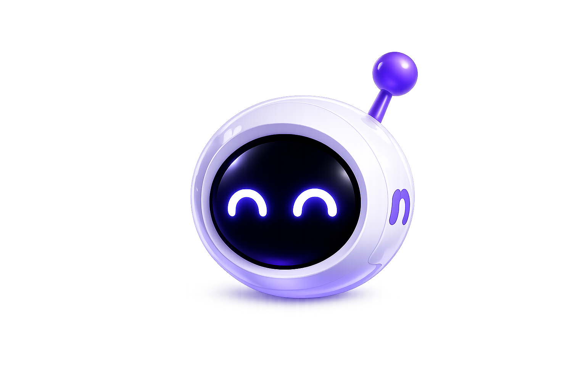
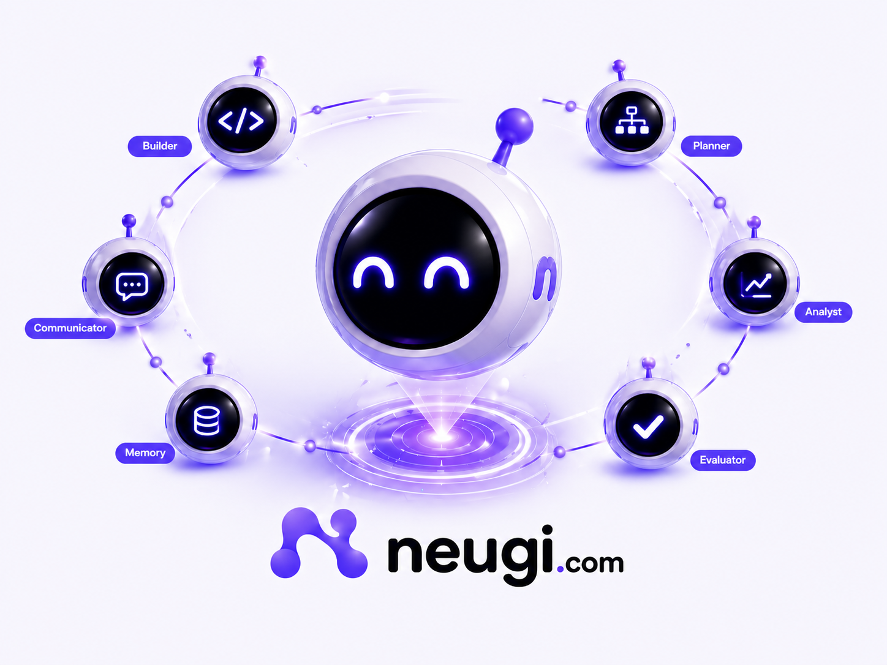
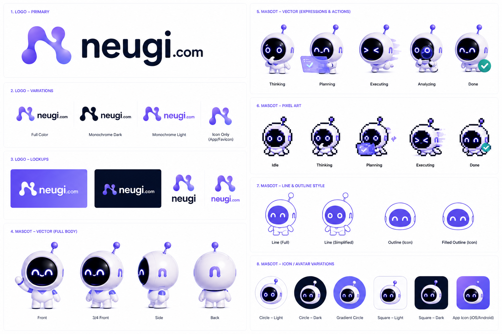
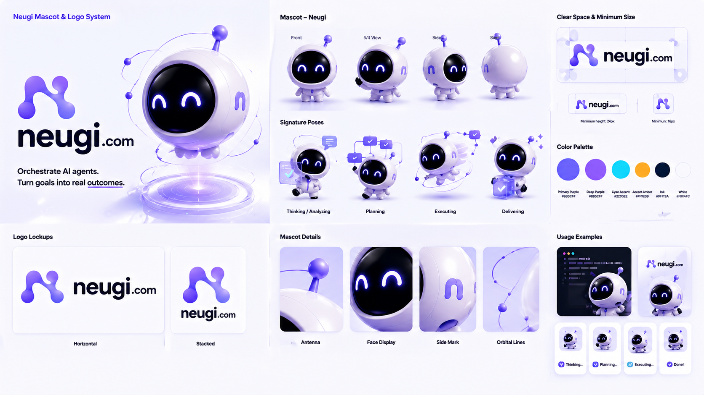
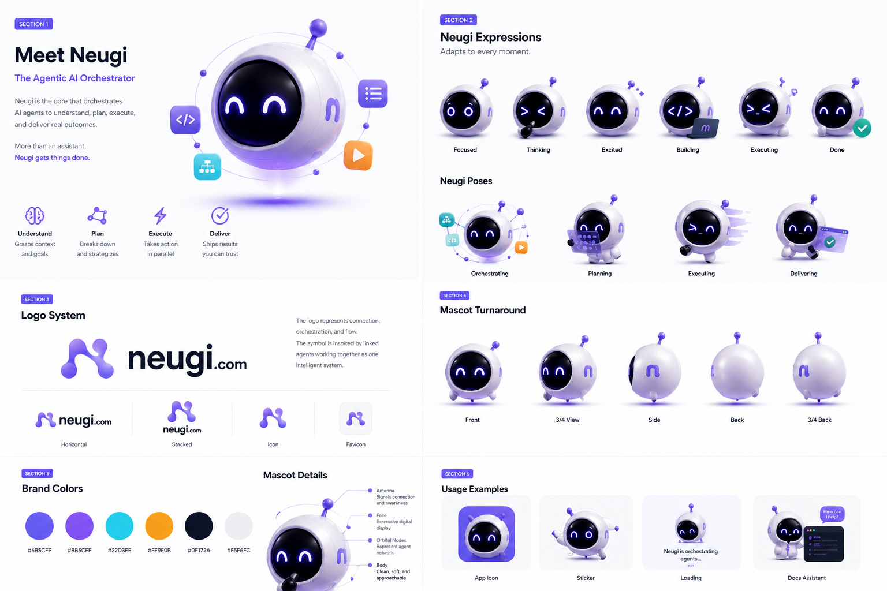
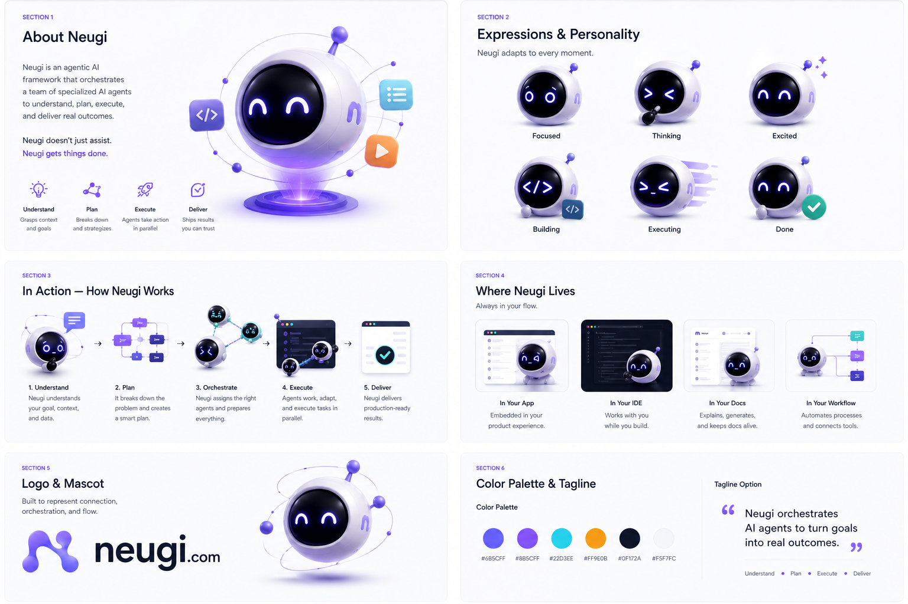
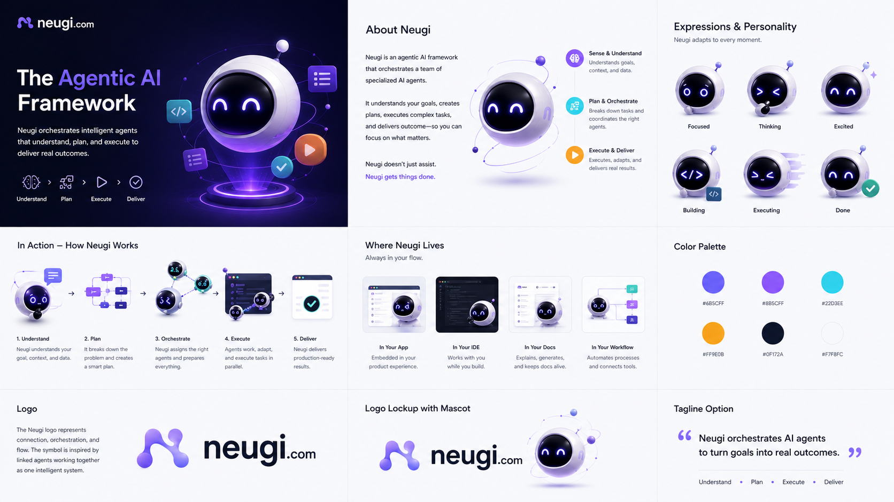
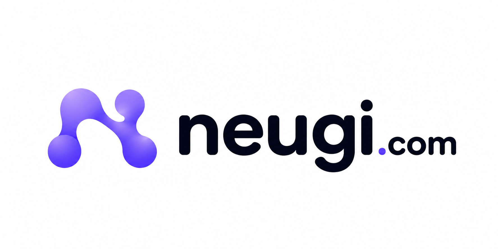

<p align="center">
  
</p>
<h1 align="center">NEUGI Swarm v2.1.1</h1>

<p align="center">
  <b>The Ultimate Agentic Framework</b>
</p>

<p align="center">
  
</p>

> **25 Subsystems | 108+ Modules | 60,000+ Lines | 61 Built-in Tools | 122 Tests Passing**

NEUGI Swarm v2 is the most advanced open-source agentic AI framework ever built. A deterministic multi-agent state machine designed for production-grade reliability at scale.

---

## Quick Start

### One-Liner Install

**macOS / Linux:**
```bash
curl -fsSL https://raw.githubusercontent.com/atharia-agi/neugi_swarm/master/neugi_swarm_v2/install.sh | bash
```

**Windows (PowerShell):**
```powershell
irm https://raw.githubusercontent.com/atharia-agi/neugi_swarm/master/neugi_swarm_v2/install.bat | iex
```

### Manual Setup

```bash
git clone https://github.com/atharia-agi/neugi_swarm.git
cd neugi_swarm/neugi_swarm_v2
pip install -e .
neugi wizard    # Interactive setup
neugi chat      # Start chatting
```

---

## Architecture

<p align="center">
  
</p>

| Subsystem | Description |
|-----------|-------------|
| **Memory** | Karpathy dreaming, hierarchical scopes, SQLite FTS5, vector embeddings |
| **Skills** | 6-tier loading, SKILL.md v3, gating, token budgets |
| **Agents** | Orchestrator-worker, evaluator-optimizer, 6 archetypes, typed LLM wiring |
| **Session** | 4 isolation modes, compaction, steering, write locks |
| **Context** | 10-section prompt assembly, token budget, KV cache |
| **MCP Server** | Full Model Context Protocol (stdio + HTTP) |
| **Governance** | Budget tracking, approval gates, immutable audit |
| **Plugins** | SDK, manifest discovery, topological deps, 8 hooks |
| **Workflows** | StateGraph, durable checkpoints, human-in-loop |
| **Learning** | Pattern tracking, auto skill generation, feedback |
| **Gateway** | WebSocket RPC, device pairing, cron, heartbeat |
| **Planning** | Tree of Thoughts, Chain of Verification, goals |
| **Tools** | 61 builtins across 10 categories, web search, browser automation |
| **Channels** | Telegram, Discord, Slack, WhatsApp unified |
| **Security** | 7-layer sandbox, neuro-symbolic, AES-256 secrets |
| **CLI+Wizard** | 17 commands, 8-step setup, interactive chat, rescue mode |
| **Dashboard** | Glass-morphism HTML, 20 REST endpoints, WebSocket, vector memory |
| **Evals** | Benchmark harness, regression detection, skill scoring |
| **Multimodal** | Vision input, screenshot analysis, computer use |
| **A2A Protocol** | Agent-to-agent mesh, capability discovery, heartbeat |
| **Web Search** | Jina Reader + DuckDuckGo fallback with caching |
| **Browser** | 3-tier automation: requests, Playwright, stealth browser |
| **Vector Memory** | all-MiniLM-L6-v2 embeddings with TF-IDF fallback |
| **WebSocket** | RFC 6455 stdlib server, real-time event streaming |
| **Computer Use** | Vision-guided browser automation with multimodal LLM |

---

## Benchmarks

| Metric | Value |
|--------|-------|
| Subsystems | 25 |
| Python Modules | 108+ |
| Lines of Code | 60,000+ |
| Built-in Tools | 61 |
| Integration Tests | 122 (all passing) |
| Cold Start | < 500ms |
| Memory Query | < 50ms |

---

## Repository Structure

```
neugi_swarm/
├── assets/                  # Brand assets (mascot, logo, guides, favicon)
├── index.html              # Landing page
├── CHANGELOG.md            # Version history
└── neugi_swarm_v2/         # V2 Framework (this is where the magic happens)
    ├── agents/             # Agent orchestration
    ├── channels/           # Multi-platform messaging
    ├── cli/                # Command-line interface + rescue wizard
    ├── context/            # Prompt assembly
    ├── dashboard/          # Web dashboard + WebSocket server
    ├── docs/               # Documentation
    ├── gateway/            # WebSocket gateway
    ├── governance/         # Budget, audit, policy
    ├── learning/           # Auto-learning system
    ├── mcp/                # MCP server implementation
    ├── memory/             # Hierarchical memory + vector embeddings
    ├── planning/           # Strategic planning
    ├── plugins/            # Plugin SDK
    ├── security/           # Sandbox & security
    ├── session/            # Session management
    ├── skills/             # Skill system
    ├── tests/              # Integration tests (122 passing)
    ├── tools/              # Tool registry (web search, browser, etc.)
    └── workflows/          # Workflow engine
```

---

## Documentation

All documentation lives in `neugi_swarm_v2/docs/`:

- [`ARCHITECTURE.md`](neugi_swarm_v2/docs/ARCHITECTURE.md) — System design & data flow
- [`MIGRATION.md`](neugi_swarm_v2/docs/MIGRATION.md) — Migrating from v1 (deprecated)
- [`API.md`](neugi_swarm_v2/docs/API.md) — REST, WebSocket, MCP, CLI reference
- [`SKILLS.md`](neugi_swarm_v2/docs/SKILLS.md) — Skill development guide
- [`PLUGINS.md`](neugi_swarm_v2/docs/PLUGINS.md) — Plugin SDK
- [`DEPLOYMENT.md`](neugi_swarm_v2/docs/DEPLOYMENT.md) — Docker, cloud, production

---

## Testing

```bash
cd neugi_swarm_v2
python -m unittest discover -s tests -v
```

**Current status:** 122/122 tests passing

---

## Docker

```bash
cd neugi_swarm_v2
docker build -t neugi:v2 .
docker-compose up -d
```

---

## Brand Assets

<p align="center">
  
  
  
  
</p>

---

## Legacy Notice

**v1 (`neugi_swarm/`) has been completely removed.** It was an unproven prototype. v2 is a from-scratch rewrite with production architecture, comprehensive tests, and proper documentation.

---

## License

MIT — Atharia AGI

---

<p align="center">
  
  <br><br>
  <b>Built by Atharia AGI</b><br>
  <a href="https://github.com/atharia-agi/neugi_swarm">GitHub</a> •
  <a href="https://twitter.com/Atharia_AGI">Twitter</a>
</p>
