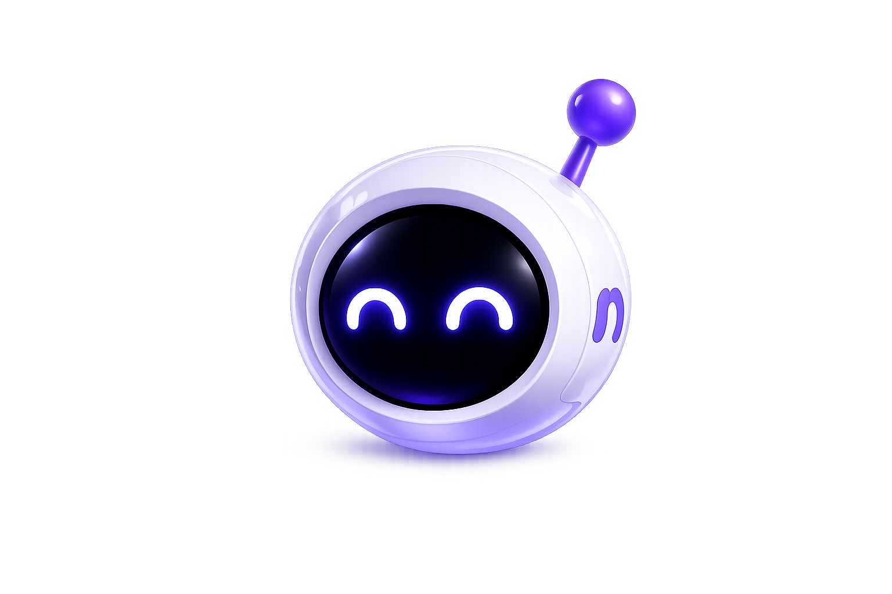
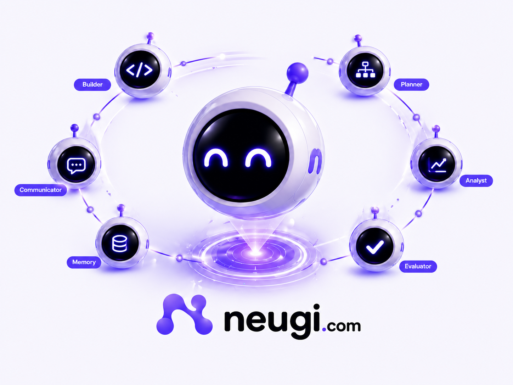
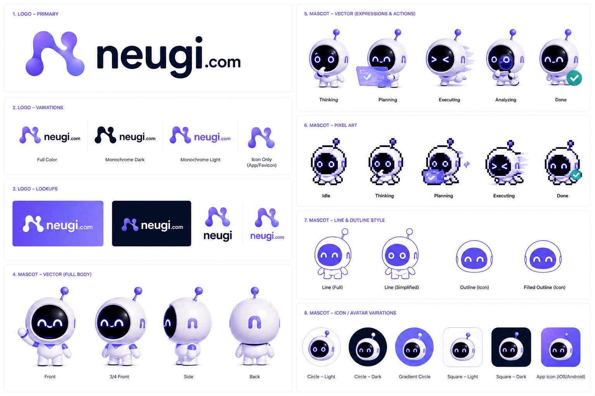
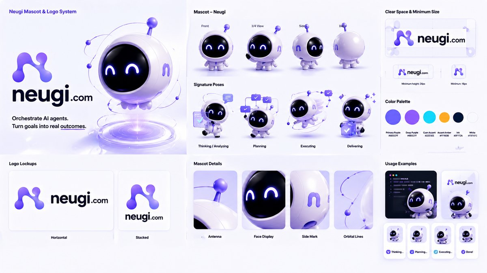
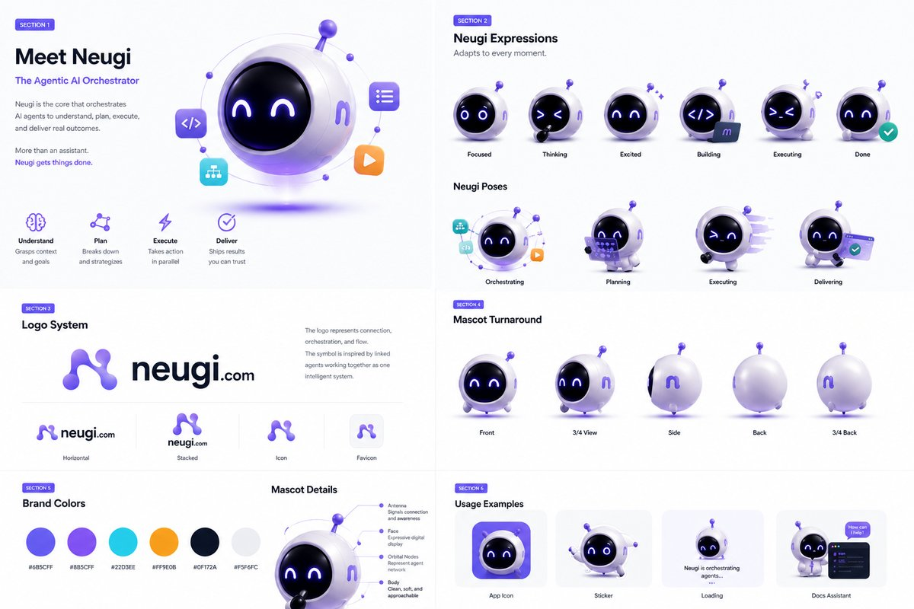
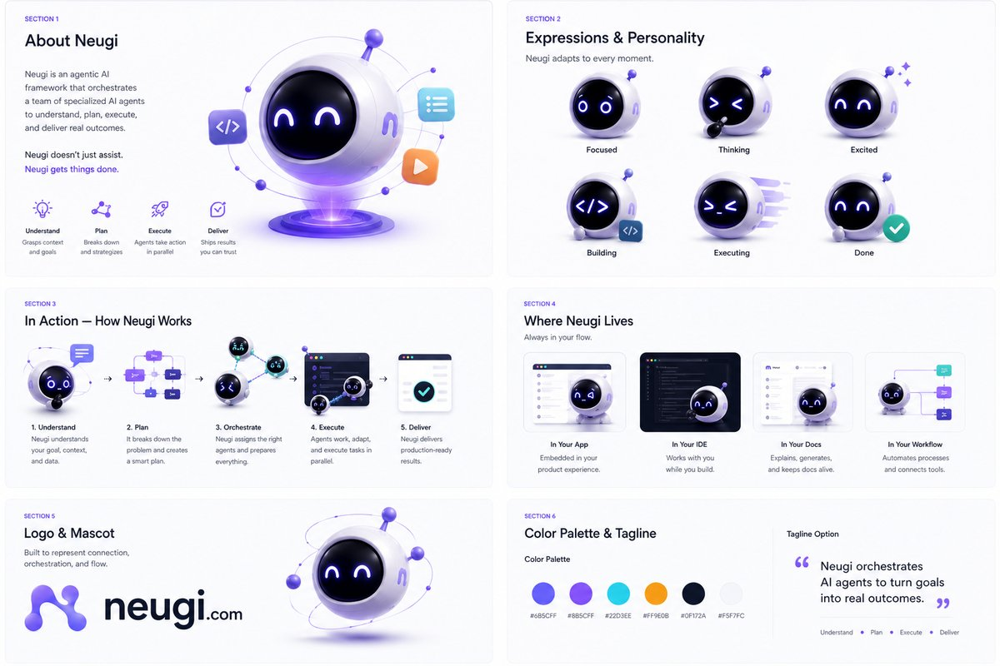
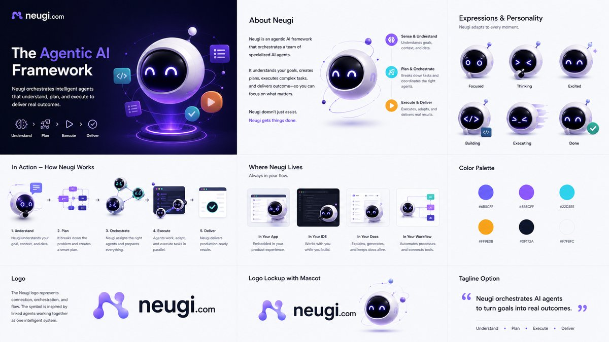
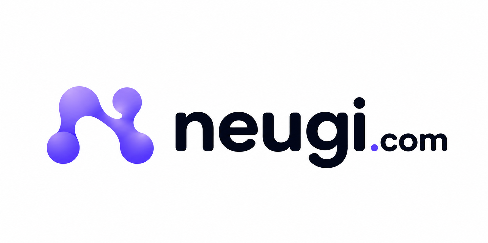

<p align="center">
  
</p>
<h1 align="center">NEUGI Swarm v2.1.3</h1>

<p align="center">
  <b>The Ultimate Agentic Framework</b>
</p>

<p align="center">
  
</p>

> **29 Subsystems | 120+ Modules | 65,000+ Lines | 61 Built-in Tools | 367 Tests Passing**

NEUGI Swarm v2 is the most advanced open-source agentic AI framework ever built. **Sovereign autonomous infrastructure** that observes, decides, executes, and reports — even during idle periods.

---

## Quick Start

### One-Liner Install

**macOS / Linux:**
```bash
curl -fsSL https://raw.githubusercontent.com/atharia-agi/neugi_swarm/master/neugi_swarm_v2/install.sh | bash
```

**Windows (PowerShell):**
```powershell
irm https://raw.githubusercontent.com/atharia-agi/neugi_swarm/master/neugi_swarm_v2/install.ps1 | iex
```

### Manual Setup

```bash
git clone https://github.com/atharia-agi/neugi_swarm.git
cd neugi_swarm
pip install -e neugi_swarm_v2
neugi wizard    # Interactive setup
neugi chat      # Start chatting
neugi soul init # Initialize agent identity (SOUL.md)
```

---

## Architecture

<p align="center">
  
</p>

| Subsystem | Description |
|-----------|-------------|
| **Memory** | Karpathy dreaming, hierarchical scopes, SQLite FTS5, vector embeddings |
| **Skills** | 6-tier loading, SKILL.md v3, gating, token budgets |
| **Agents** | Orchestrator-worker, evaluator-optimizer, 6 archetypes, typed LLM wiring |
| **Session** | 4 isolation modes, compaction, steering, write locks |
| **Context** | 10-section prompt assembly, token budget, KV cache |
| **MCP Server** | Full Model Context Protocol (stdio + HTTP) |
| **Governance** | Budget tracking, approval gates, immutable audit |
| **Plugins** | SDK, manifest discovery, topological deps, 8 hooks, browser agent example |
| **Workflows** | StateGraph, durable checkpoints, human-in-loop |
| **Learning** | Pattern tracking, auto skill generation, feedback |
| **Gateway** | WebSocket RPC, device pairing, cron, heartbeat |
| **Planning** | Tree of Thoughts, Chain of Verification, goals |
| **Tools** | 61 builtins across 10 categories, web search, browser automation |
| **Channels** | Telegram, Discord, Slack, WhatsApp unified |
| **Security** | 7-layer sandbox, neuro-symbolic, AES-256 secrets |
| **CLI+Wizard** | 17 commands, one canonical provider/model setup wizard, interactive chat, rescue mode |
| **Dashboard** | Glass-morphism HTML, 20 REST endpoints, WebSocket, vector memory |
| **Evals** | Benchmark harness, regression detection, skill scoring |
| **Multimodal** | Vision input, screenshot analysis, computer use |
| **A2A Protocol** | Agent-to-agent mesh, capability discovery, heartbeat |
| **Web Search** | Jina Reader + DuckDuckGo fallback with caching |
| **Autoresearch** | Karpathy-style iterative research: query → search → synthesize → hypothesize |
| **Autonomous** | Pro-active idle loop: observe → decide → execute → report (dreaming, goals, agents, skills) |
| **Agent Spawner** | Dynamic TypedAgent spawning for research/coder/analyst/strategist tasks |
| **Notifications** | Pro-active Telegram/Discord/Slack dispatch with digest mode & quiet hours |
| **Browser** | 3-tier automation: requests, Playwright, stealth browser |
| **Vector Memory** | all-MiniLM-L6-v2 embeddings with TF-IDF fallback |
| **WebSocket** | RFC 6455 stdlib server, real-time event streaming |
| **Computer Use** | Vision-guided browser automation with multimodal LLM |
| **Observability** | Event bus for tool execution monitoring, plugin extensibility |
| **Soul System** | Agent identity & continuity via SOUL.md pattern (static files + MemorySystem view) |

---

## New Features in v2.1.3

### Observability Event Bus
NEUGI now includes a lightweight, thread-safe event bus for monitoring tool executions and enabling plugin extensibility without modifying core components. The event bus publishes `tool_execution_success` and `tool_execution_failure` events that plugins and external systems can subscribe to.

### Browser Agent Plugin
A new plugin-based browser agent is available in `plugins/browser_agent/` that demonstrates how to extend NEUGI's capabilities without modifying core files. The plugin includes:
- `BrowserAgent`: A TypedAgent-based implementation that uses LLMs to control the BrowserTool
- Alternative reasoning-loop implementation
- Usage examples demonstrating automated web interactions

Both features are opt-in and maintain full backward compatibility with zero core modifications required.

---

## Benchmarks

| Metric | Value |
|--------|-------|
| Subsystems | 29 |
| Python Modules | 120+ |
| Lines of Code | 65,000+ |
| Built-in Tools | 61 |
| Integration Tests | 369 collected (367 passed, 2 optional browser tests skipped without Playwright) |
| AI Providers Supported | 20+ (OpenAI, Anthropic, Gemini, Groq, DeepSeek, etc.) |
| Cold Start | < 500ms |
| Memory Query | < 50ms |

---

## Repository Structure

```
neugi_swarm/
├── assets/                  # Brand assets (mascot, logo, guides, favicon)
├── index.html              # Landing page
├── CHANGELOG.md            # Version history
└── neugi_swarm_v2/         # V2 Framework (this is where the magic happens)
    ├── agents/             # Agent orchestration
    ├── channels/           # Multi-platform messaging
    ├── cli/                # Command-line interface + canonical setup/rescue wizard
    ├── context/            # Prompt assembly
    ├── dashboard/          # Web dashboard + WebSocket server
    ├── docs/               # Documentation
    ├── gateway/            # WebSocket gateway
    ├── governance/         # Budget, audit, policy
    ├── learning/           # Auto-learning system
    ├── mcp/                # MCP server implementation
    ├── memory/             # Hierarchical memory + vector embeddings
    ├── planning/           # Strategic planning
    ├── plugins/            # Plugin SDK (includes browser_agent example)
    ├── security/           # Sandbox & security
    ├── session/            # Session management
    ├── skills/             # Skill system
    ├── tests/              # Integration tests (365 passing, 2 optional skips)
    ├── tools/              # Tool registry (web search, browser, etc.)
    ├── observability/      # Event bus for monitoring and extensibility
    ├── workflows/          # Workflow engine
    └── autonomous/         # Pro-active autonomous behavior subsystem
```

---

## Documentation

All documentation lives in `neugi_swarm_v2/docs/`:

- [`ARCHITECTURE.md`](neugi_swarm_v2/docs/ARCHITECTURE.md) — System design & data flow
- [`MIGRATION.md`](neugi_swarm_v2/docs/MIGRATION.md) — Migrating from v1 (deprecated)
- [`API.md`](neugi_swarm_v2/docs/API.md) — REST, WebSocket, MCP, CLI reference
- [`SKILLS.md`](neugi_swarm_v2/docs/SKILLS.md) — Skill development guide
- [`PLUGINS.md`](neugi_swarm_v2/docs/PLUGINS.md) — Plugin SDK
- [`DEPLOYMENT.md`](neugi_swarm_v2/docs/DEPLOYMENT.md) — Docker, cloud, production
- [`AGENTIC_2026_ALIGNMENT.md`](neugi_swarm_v2/docs/AGENTIC_2026_ALIGNMENT.md) — Jan-May 2026 agentic runtime alignment

---

## Soul System — Agent Identity & Continuity

NEUGI implements the **SOUL.md pattern** (Hermes Agent / OpenClaw / Aeon) for persistent agent personality:

```bash
neugi soul init              # Create identity files
neugi soul show              # View current identity prompt
neugi soul edit SOUL.md      # Customize personality
neugi soul remember "User prefers Vim over Emacs"
```

**Files managed in `~/.neugi/soul/`:**

| File | Purpose | Storage |
|------|---------|---------|
| `SOUL.md` | Identity, worldview, values | Static file |
| `STYLE.md` | Voice, syntax, patterns | Static file |
| `USER.md` | User preferences & facts | Static file + MemorySystem sync |
| `WORLD.md` | Project/environment context | Static file |
| `MEMORY.md` | Continuity snapshot | **Rendered from MemorySystem** |

**Architecture note:** `SoulEngine` is a *view layer*, not duplicate storage. Episodic memory lives in `MemorySystem` (SQLite). `MEMORY.md` is regenerated from MemorySystem recall on each prompt assembly. This ensures single source of truth while giving the LLM rich identity context.

---

## Model Capability Routing

NEUGI **adapts its entire behavior** based on the connected model's capability:

```
User selects model → CapabilityProfile auto-built → All subsystems adapt
```

**Three tiers:**
- **LOCAL** (<7B): Fragile, needs maximal prompting, 1 tool/call, 5 autonomous actions/day
- **MEDIUM** (7B-70B): Balanced, 3 tools/call, 20 actions/day
- **CLOUD** (200B+): Native function calling, 10 tools/call, 50 actions/day

**Adaptive surfaces:**
- Prompt budgets, memory entries, tool complexity filtering
- Research depth (1–3 rounds), retry logic, circuit breaker thresholds
- Proactive decision confidence thresholds

**20+ Providers Supported:**
OpenAI, Anthropic, Google Gemini, xAI Grok, DeepSeek, Groq, Mistral AI, Cohere, Perplexity, Together AI, Fireworks AI, Moonshot (Kimi), Alibaba (Qwen), ZhipuAI (GLM), StepFun, Baidu (ERNIE), iFlytek (Spark), MiniMax, NVIDIA NIM, and any OpenAI/Anthropic-compatible endpoint.

---

## Testing

```bash
cd neugi_swarm_v2
python -m pytest tests/ -q --tb=short -p no:anchorpy
```

**Current status:** 367 passed, 2 skipped, 8 warnings on Python 3.12.10

---

## Docker

```bash
cd neugi_swarm_v2
docker build -t neugi:v2 .
docker-compose up -d
```

---

## Brand Assets

<p align="center">
  
  
  
  
</p>

---

## Legacy Notice

**v1 (`neugi_swarm/`) has been completely removed.** It was an unproven prototype. v2 is a from-scratch rewrite with production architecture, comprehensive tests, and proper documentation.

---

## License

MIT — Atharia AGI

<p align="center">
  
  <br><br>
  <b>Built by Atharia AGI</b><br>
  <a href="https://github.com/atharia-agi/neugi_swarm">GitHub</a> •
  <a href="https://twitter.com/Atharia_AGI">Twitter</a>
</p>
